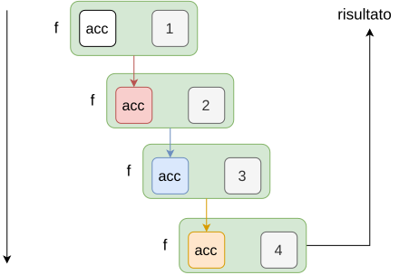
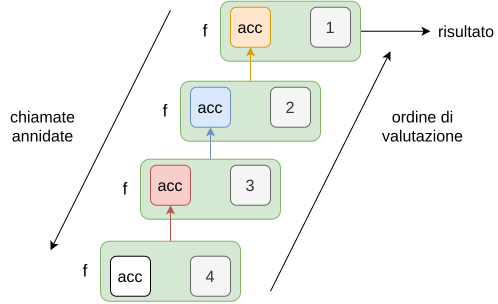
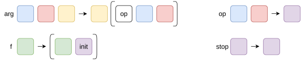
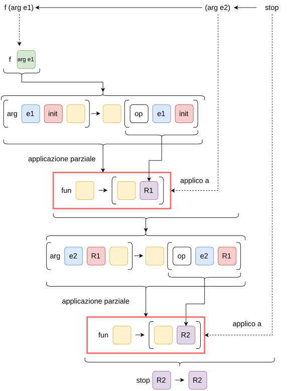
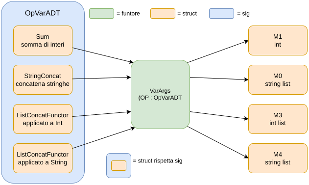
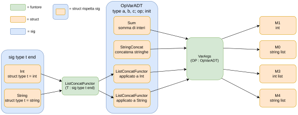

# Playing with Fun:

## Argomenti opzionali con valore di default
In molti metodi potremmo avere la necessità di utilizzare un argomento opzionale con valore di default.
```ocaml
let rec count ?(tot=0) x = function
    | [] -> tot
    | h::l1 -> 
        if (h==x) then count ~tot:(tot+1) x l1 else count ~tot:tot x l1
```
Con questa sintassi dichiariamo la presenza di un argomento opzionale `tot` che di default varrà `0`.  
Quando bisogna aggiornare il valore di questo argomenti bisogna usare la sintassi: `~<nome>:(<new_val>)` che in sostanza dice di passare `<new_val>` come argomento con etichetta `<nome>`.  
La presenza di un argomento opzionale ricade anche sui tipi dedotti dal compilatore:
```
val count : ?tot:int -> 'a -> 'a list -> int = <fun>
```

## Iterare e maneggiare le stringhe
Non possiamo iterare sul contenuto di una stringa usando il pattern matching strutturale, nulla ci vieta di usare un indice per la posizione e accedervi al carattere corrispondente:
```ocaml
let rec iter f ?(k = 0) s =
    if k < String.length s then ( f s.[k] ; iter f ~k:(k + 1) s ) ;;
```

Un altro approccio è quello di ottenere a partire dalla stringa una lista di caratteri.

## Definire un operatore
Potremmo avere la necessità di definire un operatore infisso che verrà utilizzato all'interno della mia funzione:
```ocaml
let qsort (>:) l =
    let rec qsort = function
        | [] -> []
        | h::tl -> (qsort (List.filter (fun x -> (x >: h)) tl) )
                    @ [h] @
                   (qsort (List.filter (fun x -> (h >: x)) tl) )
    in qsort l
```
In questo caso abbiato definito l'operatore `>:` che verrà utilizzato come un operatore infisso all'interno della mia funzione.  
Quando invoco la funziona posso passare a `>:`

## Currying & Partial Evaluation

### Currying
Il **currying** è una tecnica per trasformare una funzione con più argomenti in una catena di funzioni, ciascuna con un singolo argomento (applicazione parziale).  
Ad es., 
$$f(x,y) = \frac{y}{x} \xrightarrow{(2)} f(2) = \frac{y}{2} \xrightarrow{(3)} f(2)(3) = \frac{3}{2}$$
Il currying è una tecnica predefinita in ML.
```
# let f x y z = x+.y*.z;;
val f : float -> float -> float -> float = <fun>

# f 5.;;
- : float -> float -> float = <fun>
```

`let f x y z = ...` è solo zucchero sintattico per:

```ocaml
let f = fun x -> fun y -> fun z -> x +. y *. z
```

Quindi `f` è una funzione che prende solo `x` e restituisce un’altra funzione, che prende solo `y` e restituisce un’altra funzione, che prende solo `z`.  
Quindi il primo argomento passato va sempre a `x`, il secondo a `y`, il terzo a `z`.


### Valutazione parziale
Si riferisce al processo di fissare un certo numero di argomenti di una funzione, producendo un'altra funzione di arità minore.  
Ad es.
$$f(x,y) = \frac{y}{x} \xrightarrow{(x=2)} g(y) =f(2, y) = \frac{y}{2} \xrightarrow{(3)} g(3) = \frac{3}{2}$$
```
# let f x y = y/.x ;;
val f : float -> float -> float = <fun>

# let g = f 2. ;;
val g : float -> float = <fun>
```
Il vantaggio si presenta quando definisco una funzione usando dei **parametri con nome**, in questo caso posso specificare la posizione e controllare quale funzione otterrò:
```
# let compose ~f ~g x = f (g x)
val compose : f:('a -> 'b) -> g:('c -> 'a) -> 'c -> 'b = <fun>

# let compose' = compose ~g: (fun x -> x**3.)
val compose' : f:(float -> 'a) -> float -> 'a = <fun>
```

## Map, Filter and Reduce

### Panoramica

- `map` = applicare una funzione a tutti gli elementi della lista;
- `filter` = filtrare alcuni elementi dalla lista in base a un predicato;
- reduce = ridurre l'intera lista a un singolo valore secondo una funzione cumulativa.

Rappresentano il pattern di programmazione più ricorrente nella programmazione funzionale.

### Map
Ricordiamo una possibile implementazione di `map`:
```ocaml
let rec map f = function
    | h::l1 -> f h::map f l1
    | _ -> [];;
```
Il modulo `List` ha la sua implementazione di map:
``` 
# List.map;;
val map : ('a -> 'b) -> 'a list -> 'b list
```


### Filter
Anche per `filter` non è complesso fornirne un'implementazione:
```ocaml
let rec filter p = function
    [] -> []
    | h::l -> if p h then h :: filter p l else filter p l;;
```
Ma anche in questo caso il modulo `List` ha la sua implementazione:

- `List.filter f l`: restituisce tutti gli elementi della lista `l` che soddisfano il predicato `f`.


### Reduce
Anche per `reduce` vediamo una possibile implementazione:
```ocaml
let rec reduce acc op = function
    [] -> acc
    | h::tl -> reduce (op acc h) op tl ;;
```


### Folding
`reduce` è un esempio di folding (piegatura), ossia, iterare una funzione binaria arbitraria su un insieme di dati costruendo progressivamente un valore di ritorno.

Le funzioni possono essere associative in due modi (sinistro e destro), quindi il folding può essere realizzato:

- right fold:  
combinando il primo elemento con il risultato della combinazione ricorsiva del resto, ad es. 

    $$0 + (1 + (2 + (3 + (7 + (25 + 4)))))$$

- left fold:  
combinando il risultato della combinazione ricorsiva di tutti gli elementi tranne l'ultimo, con l'ultimo

Il modulo `List` fornisce le funzioni:

- `List.fold_left f acc l`:

    ```
    val fold_left : ('acc -> 'a -> 'acc) -> 'acc -> 'a list -> 'acc
    ```
    Consideriamo la lista $[1,2,3,4]$

    

- `List.fold_right f l acc`:

    ```
    val fold_right : ('a -> 'acc -> 'acc) -> 'a list -> 'acc -> 'acc
    ```
    Consideriamo la lista $[1,2,3,4]$

    


## Approfondimento sulle funzioni

### Funzioni con un numero variabile di argomenti
I **variadici**, sono funzioni chiamabili con un numero variabile di elementi.  
Possiamo costruire in OCamL una serie di funzioni per ottenere questo riusultato.

OCaml non ha funzioni variadiche native. Il trucco è far sì che **ogni argomento venga consumato da una funzione che restituisce un’altra funzione, e che il risultato venga passato avanti come “accumulatore”**.
```ocaml
let arg x = fun y rest -> rest (op x y) ;;
let stop x = x;;
let f g = g init;;
```

- `arg x`: è una funzione parzialmente applicata.  
 Aspetta ancora `y` (l’accumulatore corrente) e `rest` (il “resto della catena”).  
 Quando li riceve, calcola `op x y` e lo passa a `rest`.
 - `op`: funzione che spiega come combinare il nuovo argomento `x` con l’accumulatore `y`.
 - `init`: il valore iniziale dell’accumulatore.
 - `stop`: l’identità. Chiude la catena e restituisce l’accumulatore finale.
 - `f g = g init`: avvia la catena, passando `init` alla prima funzione.

```
# let op = fun x y -> x+y;;
val op : int -> int -> int = <fun>

# let init = 0;;
val init : int = 0
```
`varargs.ml` usa `op` e `init` senza definirli: vanno quindi definiti prima di caricare il file.  
Al momento del `#use`, `arg` e `f` si legano ai valori che `op` e `init` hanno in quell’istante. Se in seguito li ridefinisco, devo ricaricare il file.
``` 
# #use "varargs.ml";;
val arg : int -> int -> (int -> 'a) -> 'a = <fun>
val stop : 'a -> 'a = <fun>
val f : (int -> 'a) -> 'a = <fun>

f (arg 1) (arg 2) (arg 7) (arg 25) (arg (-1)) stop;;
- : int = 34
```

#### Schema alto livello variadici:
Questa è la rappresentazione ad alto livello delle funzioni che servono:



Dopo aver definito effettivamente `op`, `stop` e `init`, questa è la catena che otteniamo:




### Funtore per funzioni con un numero variabile di argomenti
L'approccio precedente deve essere ricaricato ogni volta che serve un tipo diverso per `f`.  
Questo perchè `op` e `init` sono nomi globali. Se voglio passare da somma di interi a lista di stringhe, devo ridefinire `op` e `init` e ricaricare il file.  
Non si può avere le due versioni contemporaneamente.

Una soluzione è usare un **funtore**: prende un modulo come parametro e restituisce un modulo.  
Qui serve che `arg`, `stop` e `f` non dipendano da un `op` e un `init` globali, ma da quelli di un modulo che viene passato.

Servono tre pezzi.

- un tipo di dato astratto (OpVarADT):

    ```ocaml
    module type OpVarADT = sig
        type a and b and c
        val op : a -> b -> c
        val init : c
    end
    ```

- Il funtore `VarArgs`:

    ```ocaml
    module VarArgs (OP : OpVarADT.OpVarADT) = struct
        let arg x = fun y rest -> rest (OP.op x y)
        let stop x = x
        let f g = g OP.init
    end
    ```

    Il codice è lo stesso di prima, ma `op` e `init` diventano `OP.op` e `OP.init`, cioè quelli del modulo ricevuto.

    Ci dice che per usare VarArgs, serve un modulo che rispetti la signature `OpVarADT` che definisce tre tipi `a`, `b`, `c`, un’operazione `op` e un valore iniziale `init`.

- Le implementazioni concrete:

    ```ocaml
    module Sum = struct
        type a = int and b = int and c = int
        let op = fun x y -> x + y
        let init = 0
    end

    module StringConcat = struct
        type a = string and b = string list and c = string list
        let op = fun (x: string) y -> y @ [x]
        let init = []
    end
    ```
Ora non ci resta che applicare il funtore:

```
# #use "OpVarADT.mli";;
# #use "sum.ml";;
# #use "concat.ml" ;;
# #use "varargs.ml" ;;

# module M0 = VarArgs(StringConcat) ;;
# module M1 = VarArgs(Sum) ;;

# M1.f (M1.arg 1) (M1.arg 2) (M1.arg 7) M1.stop;;
- : Sum.c = 10

# M0.f (M0.arg "Hello") (M0.arg "World") (M0.arg "!!!") M0.stop ;;
- : StringConcat.c = ["Hello"; "World"; "!!!"]
```
Ogni applicazione produce un modulo nuovo, già specializzato. Ora si può usare entrambi nella stessa sessione, senza ricaricare nulla.




### Funtore di funtore
Consideriamo di fare la stessa cosa di prima ma con delle **liste generiche**.  
Per `StringConcat` abbiamo scritto a mano il tipo `string` ma ora vogliamo un unico modulo `ListConcat` che funzioni per qualsiasi `'a list`.  
Ma la signature `OpVarADT` vuole tipi semplici (`a`, `b`, `c`), senza parametri come invece sarebbe `'a`, quindi non puoi scrivere:

```ocaml
module ListConcat = struct
  type a and b = a list and c = a list
  ...
end
```
Qui `a` è un tipo astratto, cioè senza definizione: per il compilatore non è `int`, né `string`, né niente. Quando poi si prova `M2.arg "Hello"`, il compilatore risponde che “Hello” è una `string` ma si aspettava un `ListConcat.a`, e nessun valore concreto ha quel tipo.

#### Funtore anche per il tipo
Se non puoi parametrizzare con `'a`, parametrizzi con un modulo che contiene il tipo:
```ocaml
module ListConcatFunctor (T : sig type t end) = struct
  type a = T.t and b = a list and c = a list
  let op = fun (x: a) y -> y @ [x]
  let init = []
end
```
`T : sig type t` end è un modulo che contiene solo un tipo `t`, e `a` viene definito come `T.t`.  
Ora il tipo è concreto, ma lo scegli tu al momento dell’uso:
```ocaml
module M3 = VarArgs(ListConcatFunctor(struct type t = int end))
module M4 = VarArgs(ListConcatFunctor(struct type t = string end))
```
Qui ci sono due funtori annidati:

- prima `ListConcatFunctor` costruisce un modulo “concatena liste di int” (o di string), 
- poi `VarArgs` lo trasforma in `arg`/`stop`/`f` specializzati.

```
# M3.f (M3.arg 2) (M3.arg 3) (M3.arg 4) M3.stop;;
- : int list = [2; 3; 4]

# M4.f (M4.arg "Hello") (M4.arg "World") M4.stop;;
- : string list = ["Hello"; "World"]
```

